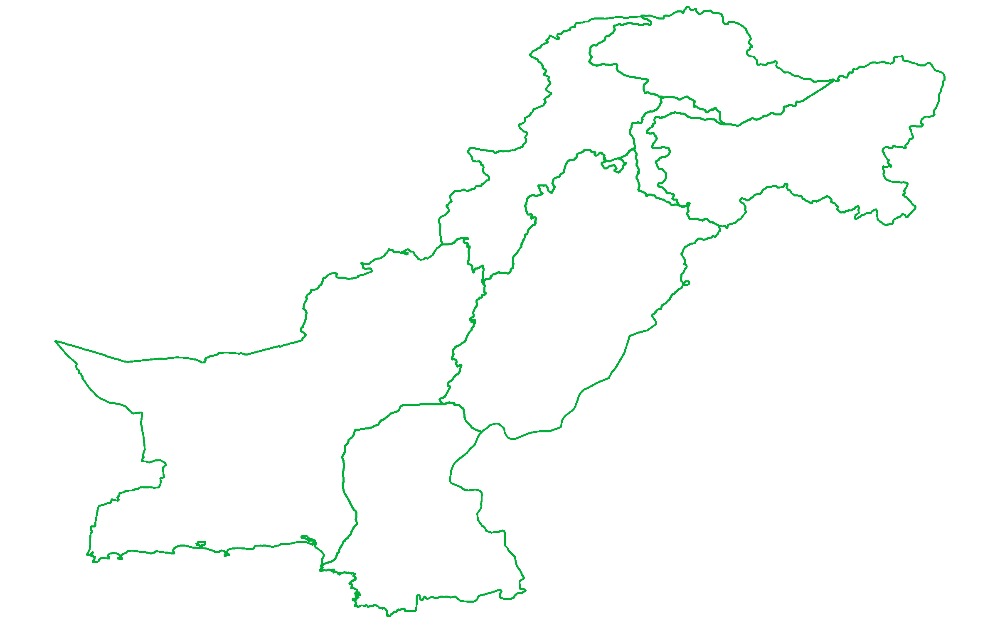

# Pakistan Map
Spatial files for the map of Pakistan. The complete map of Pakistan was not available anywhere on the web. So this is the only source of the complete spatial file.

## What's Special
Pakistan's maps available elsewhere on the web do not include the Indian Occupied Kashmir (IOK). Also, the FATA region is shown separately. In this map, I've added IOK and merged FATA with the KP province.

## Coordinate Reference System
EPSG:4326 - WGS 84

## Attribute Table
FID | NAME | SHORT_NAME |
| ---: | --- | --- |
| 1 | Azad Jammu and Kashmir | AJK |
| 2 | Balochistan | Balochistan |
| 3 | Gilgit Baltistan | GB |
| 4 | Indian Occupied Kashmir | IOK |
| 5 | Islamabad | ICT |
| 6 | Khyber Pakhtunkhwa | KP |
| 7 | Punjab | Punjab |
| 8 | Sindh | Sindh |

## GeoJSON File
All the geojson data is set in a variable called "pak".

